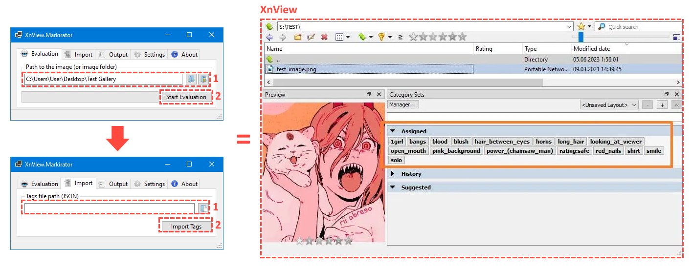
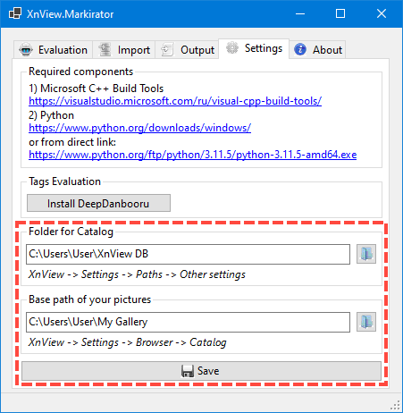
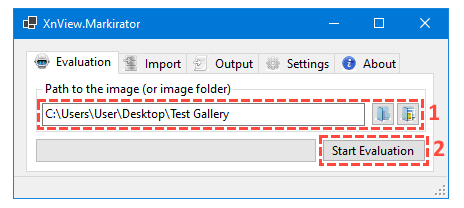
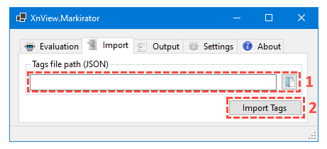

# XnView.Markirator  
This is simple application that is designed to integrate [DeepDanbooru] *(image tag estimation system)* and [XnView] *(image viewer)*. You can also use it to assign categories (tags) with [XnView] via JSON files (without using [DeepDanbooru]).


## Installation
1.  Install [Microsoft C++ Build Tools](https://visualstudio.microsoft.com/ru/visual-cpp-build-tools/)
2.  Install [Python](https://www.python.org/ftp/python/3.11.5/python-3.11.5-amd64.exe)
3.  Download and unzip the XnView.Markirator archive
4.  Run XnView.Markirator.exe and install DeepDanbooru ("Settings" -> "Tags Evaluation" -> "Install DeepDanbooru"). Wait until the installation is complete (it may take a time).
5.  Setup XnView settings



## How To Use

1.  Evaluate tags



After successful execution of this action, a new JSON file (text file with information about processed images) will appear in the EvaluatedTags folder in the application directory.

2.  Import tags to XnView



Select JSON file from previous step and start import tags.

## Import Data Format
The `import` command requires a JSON file with the following data structure:
```json
[
  {
    "FilePath": "D:\\Images\\Catalog\\image1.jpg",
    "Tags": ["tag1", "tag2", "tag3"]
  },
  {
    "FilePath": "D:\\Images\\Catalog\\image2.jpg",
    "Tags": ["tag2", "tag5"]
  }
]
```
_You only need this information if you want to set the tags manually without using DeepDanbooru._

## Used Components
1) [DeepDanbooru]
2) [Fugue Icons](https://p.yusukekamiyamane.com/)

[//]: # (Links)
   [DeepDanbooru]: <https://github.com/KichangKim/DeepDanbooru>
   [DeepDanbooru Pretrained Model]: <https://github.com/KichangKim/DeepDanbooru/tags>
   [XnView]: <https://www.xnview.com>  
